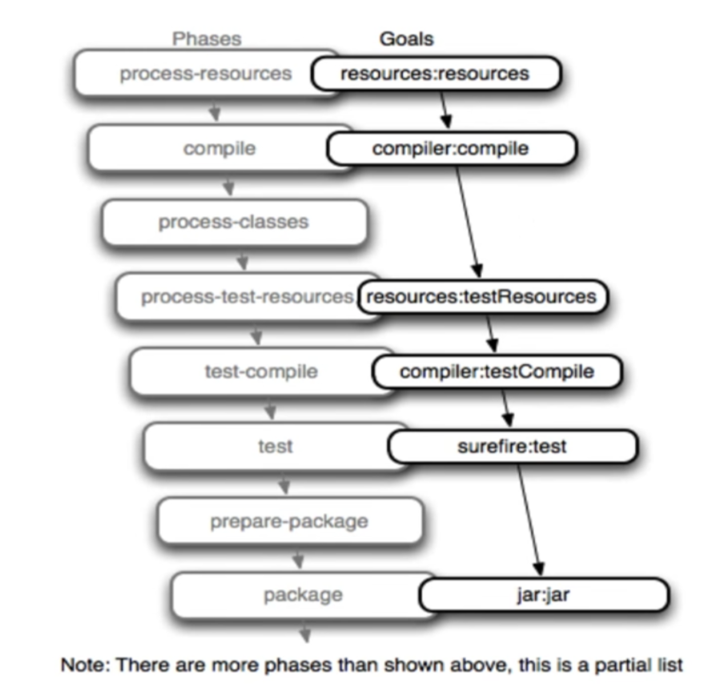

# 구성
마이크로서비스를 구현하기 위한 기술 스택은 여러가지가 있지만 이책에서는 아래 기술을 활용해 마이크로 서비스를 구현한다. 

* 스프링 부트 2.0
* 스프링 이니셜라이저
* 메이븐
* 인텔리제이 IDEA
* 컴포넌트 스캔
* 스프링 애플리케이션 컨텍스트
* 스프링 설정
* 스프링 표현식 언어(SpEL-Spring Expression Language)


## 참고사항

- 환경 구성은 개발자의 개발환경에 따라 다르므로 여기서는 Mac, Windows 순으로 JDK, Maven, Intellij 설치를 설명한다.
- SpringInitializer 이후 부분은 공통적으로 적용되는 부분이므로 Mac Windows를 구분하지 않습니다.
- [Mac 환경 설정 링크](#Mac)
- [Windows 환경 설정 링크](#Windows)


## Mac

### JDK, Maven, Intellij-ce 한번에 설치하는 스크립트
```bash
/usr/bin/ruby -e "$(curl -fsSL https://raw.githubusercontent.com/Homebrew/install/master/install)"
brew install caskroom/cask/brew-cask
brew tap caskroom/versions
brew cask install java8
```


### JDK 설치

JDK는 Java Development Kit의 약자로 Java 어플리케이션을 개발하기 위해 설치해야 하는 플랫폼이다.

또한, JDK는 Oracle JDK, OpenJDK가 있으며 책에서는 Oracle JDK 설치를 설명한다.

Mac에서는 homebrew라는 패키지 관리 도구를 활용해 설치할 수 있다.

```bash
/usr/bin/ruby -e "$(curl -fsSL https://raw.githubusercontent.com/Homebrew/install/master/install)"
brew install caskroom/cask/brew-cask
brew tap caskroom/versions
brew cask install java8
brew install maven
brew install intellij-idea-ce
```


프로파일에 설정한다.

```bash
vi ~/.bash_profile   ## zsh를 사용할 경우 vi ~/.zshrc

# 제일 아랫쪽에 아래 내용 입력후 저장
export JAVA_HOME=jdk-install-dir
export PATH=$JAVA_HOME/bin:$PATH

# 아래 명령어로 변경된 프로파일 적용
source ~/.bash_profile
```


### Maven 설치

homebrew를 이용해 아래와 같이 설치 한다.

```bash
brew install maven
```


### Intellij-ce설치

Intellij-ce 는 커뮤니티 버전입니다. 해당 버전도 homebrew를 통해 설치할 수 있다.

```bash
brew install intellij-idea-ce
```


(사견 입니다.)

Intellij를 설치하는 방법으로는 여러가지가 있지만 개인적으로는 Jetbrain (Intellij 만든 회사)홈페이지에서 ToolBox 어플리케이션을 이용해 설치하는 것을 추천합니다.

해당 어플리케이션을 이용하면 본인의 프로젝트 확인 및 IDEA 업데이트를 손쉽게 할 수 있고 다른 Jetbrain사의 프로그램을 한번에 활용할 수 있다.

아래와 같이 원하는 솔루션 설치를 할 수 있다.
<br>


프로젝트 생성시 Toolbox에서 통합관리 가능합니다.
<br>


## Windows

### JDK 설치

- https://www.oracle.com/technetwork/java/javase/downloads/index.html 에 있는 Java SE Development Kit 8u144 또는 그 이상을 사용한다.
- 설치 후 윈도우 환경 변수 설정을 해야 한다. (참고: https://vmpo.tistory.com/6)

### Maven 설치

- Https://maven.apache.org/download.cgi에서 maven 파일을 다운로드 하고 압축을 해제한다. (zip 파일을 받으면 됨)
- 받은 경로를 환경변수 설정해 어디서든 mvn 명령어를 사용할 수 있도록 세팅한다.
  - Ex) c:\maven-install-directory\bin

### Intellij-ce 설치

- https://www.jetbrains.com/idea/download에서 운영체제에 적합한 버전을 다운 받아 설치한다.

  (맥 환경에서도 밝혔듯이 사견으로는 ToolBox를 통해서 설치하는 것을 추천함)

  


## Mac/Windows 공통 적용 부분

### Spring-Initializer 로 샘플 프로젝트 생성 

Springboot 어플리케이션을 템플릿처럼 생성가능한 Spring-Initializer라는 사이트가 있습니다.

해당 사이트를 활용해 샘플 프로젝트를 생성-> Zip파일로 다운로드 -> 프로젝트로 Import 하는 순서로 진행합니다.

- 브라우저에서 https://start.spring.io 로 이동합니다.

  <br>
  

  - Project: Maven Project 선택
  - Language: Kotlin 선택
  - Spring Boot: 원하는 버전 선택
  - Project Metadata
    - Group: com.microservices
    - Artifact: chapter2
  - Packaging: Jar
  - Java: 8

- 하단의 generate 버튼 (  )을 눌러 생성된 샘플 파일을 다운 받습니다.

- 

### 생성된 프로젝트 파일 검토
- 파일 압축을 해제하면 아래와 같은 파일을 트리형태로 확인할 수 있다.
```bash
[.mvn]
	[wrapper]
		maven-wrapper.jar
		maven-wrapper.properties

[src]
	[main]
		[kotlin]
			[com]
				[microservices]
					[chapter2]
						Chapter2Application.kt
	[resources]
		[static]
		[templates]
		application.properties

[test]
	[kotlin]
		[com]
			[microservices]
				[chapter2]
					Chapter2ApplicationTests.kt
					
.gitignore

mvnw
mvnw.cmd
pom.xml

```

- .mvn (메이븐 파일)

  - 메이븐 랩퍼는 메이븐 버전을 지정해서 시스템 (이전에 OS에 설치한 메이븐)과 별개로 고정적인 버전관리를 할 수 있도록 도와준다.

    maven-wrapper.properties의 옵션으로 지정할 수 있다.

    - mvnw.cmd : 윈도우 용 스크립트
    - mvnw : 맥 / 리눅스용 스크립트
    - pom.xml : 메이븐의 구성파일, 디펜던시, 플러그인등을 여기에 xml 형태로 정의한다.

- 소스 파일
  
- 스프링 이니셜라이저에서 구성한대로 src 및 test에서 패키지가 구성된다.
  
- 리소스 파일

  - 정적 리소스(HTML, JS, Image) 및 application.properties (스프링 부트 설정파일)이 위치한다.

- gitignore (해당 파일은 한글보다 영문이 더 나을 것 같아 이렇게 표기)

  - git이 추적하지 않을 파일(IDEA 설정, 패스워드등 민감데이터)를 기록해 git이 필요없는 데이터가 레파지토리에 저장되지 않게 한다.

    (사견: gitignore 파일 구성은 https://www.toptal.com/developers/gitignore 에서 손쉽게 구성할 수 있음)


### 메이븐 사용

- 스프링이니셜라이저로 생성하고 압축해제한 디렉토리에서 아래 명령을 수행한다.
```bash
mvn compile
```

- 운영체제에 설치한 메이븐을 통해서 프로젝트를 빌드하라는 명령어이다.

- 메이븐은 올바르게 구성된 pom.xml 을 참고, 프로젝트를 빌드한다.

- 운영체제와 관계없이 고정된 메이븐 버전으로 구성하고 싶으면 메이븐 래퍼 (maven wrapper)를 사용한다.

  ```bash
  mvnw compile
  ```
  
  - 위의 명령어와 동일하나 메이븐 버전을 원하는 버전으로 고정할 수 있다.

#### 메이븐 라이프 사이클

- 메이븐은 다음과 같은 단계로 수행됨

  - 애플리케이션 의존성(Dependency Libarary) 다운로드

  - 컴파일 (메이븐 플러그인 활용)

  - 메이븐은 라이프 사이클 단계가 각각 있으며 다음 단계는 이전 단계를 포함해서 수행한다. 
    (validate -> compile의 단계라고 하면 mvn compile 명령어 수행시 validate도 포함되어 수행됨)

  - 각각의 라이프 사이클 단계는 다음과 같다.

    - clean: 메이븐 빌드로 생성된 타겟 파일 (jar, war등)을 제거한다.
    - validate: pom 파일의 유효성 검증
    - compile: test를 제외하고 프로젝트 컴파일
    - test: 프로젝트에서 유닛 테스트 수행
    - package: 프로젝트를 패키징 (jar, war 등)
    - (사견: 책에서는 간략하게 설명했지만 maven은 생각보다 복잡한 메커니즘의 라이프사이클을 가지고 있습니다. 

    https://m.blog.naver.com/PostView.nhn?blogId=goddlaek&logNo=221242091247&proxyReferer=https:%2F%2Fwww.google.com%2F )

#### 메이븐의 목표

- 메이븐은 플러그인 개념을 지원, 플러그인은 목표를 사용해 특정단계에 연결됨
	<br>
	
- ex) mvn kotlin:goal

  - mvn : 메이븐 실행 명령어 (또는 mvnw)
  - kotlin: kotlin 플러그인을 의미
  - goal: 실제 수행할 명령

  

#### pom 파일 이해

- 메이븐을 실행하면 현재디렉토리의 pom.xml을 찾아 pom.xml 파일에 명시된 작업 (의존성 다운로드, 컴파일등)을 수행함 (파일 경로 지정 가능)

- pom 파일은 Project Object Model의 약자임

- pom.xml 이 하는 역할은 아래와 같음

  - 프로젝트 정의: 프로젝트의 그룹, 프로젝트, 아티팩트, 버전, 패키징 방법을 명시함
  - 메이븐 Parent
    - 메이븐은 상위 메이븐 프로젝트를 참조할 수 있음.
    - BOM (Bill Of Material)파일을 통해 부모 프로젝트에서 생성한 설정을 그대로 가져올 수 있음 (사견: 생산성이 좋아질 수 있으나 링크를 타고 확인을 해야 하기 때문에 개인적으로는 pom.xml 파일을 따로 구성하는 편임)
  - 프로젝트 프로퍼티
    - 프로퍼티에서는 크틀린 컴파일러 버전 또는 파일 인코딩등을 설정할 수 있다.
  - 의존성
    - 프로젝트에 필요한 라이브러리들을 메이븐 센트럴 레파지토리 (인터넷에 있는 공용 저장소) 또는 사설 레파지토리등에서 다운받을 수 있음
    - ex) java의 apache commons 라이브러리
  - 빌드
    - 빌드는 플러그인을 통해서 하게 되는데 해당 프로젝트는 코틀린, 스프링부트 어플리케이션이므로 spring-boot, 코틀린 플러그인등이 확인될 것 이다.
  - 저장소 (레파지토리)
    - 의존성을 조회 및 다운로드 함
    - 기본적으로는 메이븐 센트럴 레파지토리에서 다운로드
    - 엔터프라이즈 환경 같은 경우 넥서스(사설 레파지토리)를 구성해서 따로 관리하기도 함

  

### 인텔리제이 IDEA 사용

- 이전에는 IDEA로 이클립스를 많이 사용했지만 현재 개발자들이 선호하고 많이 사용하는 IDEA는 젯브레인사에서 만든 인텔리제이 이다.
- 젯브레인사는 코틀린 언어를 개발한 회사이기도 하다.

#### 메이븐 프로젝트 열기

- 인텔리제이 IDEA 오픈
- Open or Import 클릭 -> 스프링 이니셜라이저로 다운로드하고 압축해제한 디렉토리 오픈

#### 라이프사이클 단계 및 목표 실행

- 인텔리제이는 메이븐 프로젝트 창을 제공함
- 인텔리제이 메이븐 프로젝트 창은 메뉴 -> tool -> Windows -> Maven Projects에서 선택가능
- 해당 창에서 라이프 사이클 단계를 마우스로 두번 클릭하면 해당 단계가 수행됨
  - ex) compile 단계 두번 클릭은 mvnw compile과 같은 의미
- m 버튼을 클릭 사용자화 가능
  - m 버튼 클릭 -> clean compile 입력 -> 실행
- 스프링 부트 어플리케이션을 Run 하려면 Plugin 섹션 확장 -> spring-boot-> spring-boot:run을 더블 클릭하면 됨

#### 마이크로서비스 수정

- 

#### 디버깅
#### 팁과 트릭


