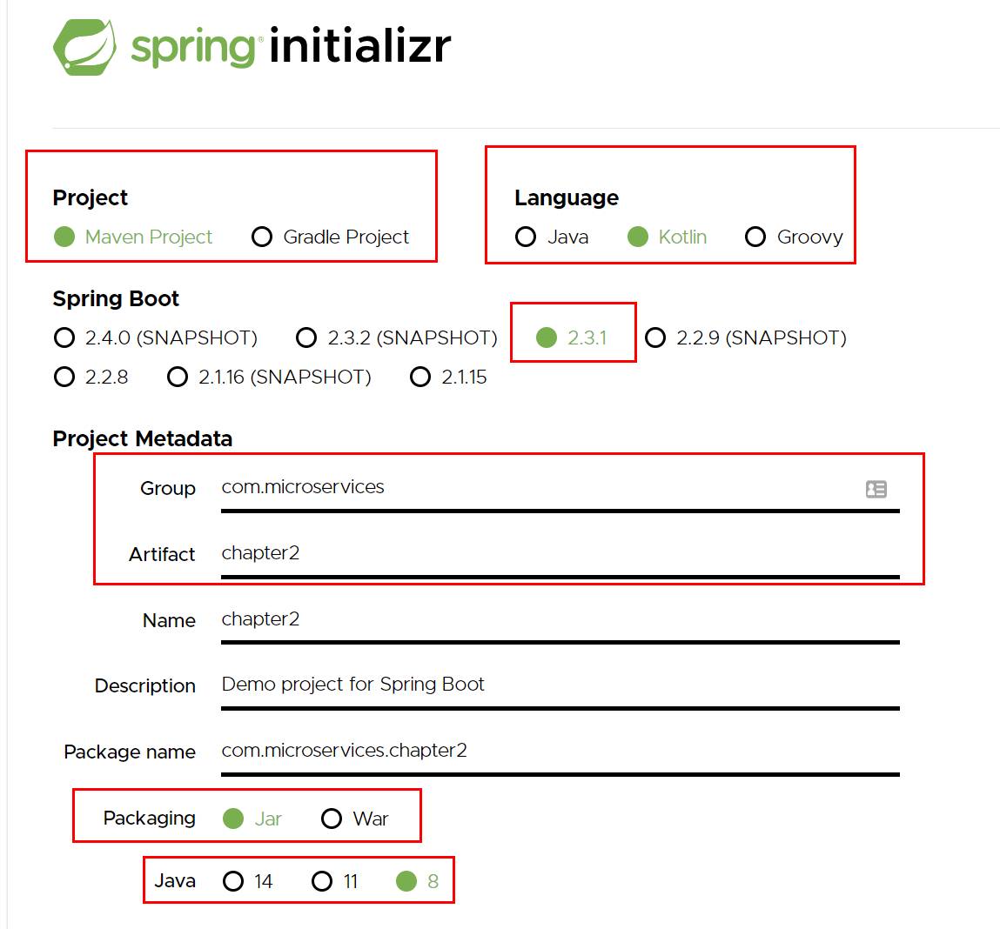

# 구성
마이크로서비스를 구현하기 위한 기술 스택은 여러가지가 있지만 이책에서는 아래 기술을 활용해 마이크로 서비스를 구현합니다. 

* 스프링 부트 2.0
* 스프링 이니셜라이저
* 메이븐
* 인텔리제이 IDEA
* 컴포넌트 스캔
* 스프링 애플리케이션 컨텍스트
* 스프링 설정
* 스프링 표현식 언어(SpEL-Spring Expression Language)


## 참고사항

- 환경 구성은 개발자의 개발환경에 따라 다르므로 여기서는 Mac, Windows 순으로 JDK, Maven, Intellij 설치를 설명합니다.
- SpringInitializer 이후 부분은 공통적으로 적용되는 부분이므로 Mac Windows를 구분하지 않습니다.
- [Mac 환경 설정 링크](#Mac)
- [Windows 환경 설정 링크](#Windows)


## Mac

### JDK, Maven, Intellij-ce 한번에 설치하는 스크립트
```bash
/usr/bin/ruby -e "$(curl -fsSL https://raw.githubusercontent.com/Homebrew/install/master/install)"
brew install caskroom/cask/brew-cask
brew tap caskroom/versions
brew cask install java8
```


### JDK 설치

JDK는 Java Development Kit의 약자로 Java 어플리케이션을 개발하기 위해 설치해야 하는 플랫폼입니다.

또한, JDK는 Oracle JDK, OpenJDK가 있으며 책에서는 Oracle JDK 설치를 설명합니다.

Mac에서는 homebrew라는 패키지 관리 도구를 활용해 설치할 수 있습니다.

```bash
/usr/bin/ruby -e "$(curl -fsSL https://raw.githubusercontent.com/Homebrew/install/master/install)"
brew install caskroom/cask/brew-cask
brew tap caskroom/versions
brew cask install java8
brew install maven
brew install intellij-idea-ce
```


프로파일에 설정합니다.

```bash
vi ~/.bash_profile   ## zsh를 사용할 경우 vi ~/.zshrc

# 제일 아랫쪽에 아래 내용 입력후 저장
export JAVA_HOME=jdk-install-dir
export PATH=$JAVA_HOME/bin:$PATH

# 아래 명령어로 변경된 프로파일 적용
source ~/.bash_profile
```


### Maven 설치

homebrew를 이용해 아래와 같이 설치 합니다.

```bash
brew install maven
```


### Intellij-ce설치

Intellij-ce 는 커뮤니티 버전입니다. 해당 버전도 homebrew를 통해 설치할 수 있습니다.

```bash
brew install intellij-idea-ce
```


(사견 입니다.)

Intellij를 설치하는 방법으로는 여러가지가 있지만 개인적으로는 Jetbrain (Intellij 만든 회사)홈페이지에서 ToolBox 어플리케이션을 이용해 설치하는 것을 추천합니다.

해당 어플리케이션을 이용하면 본인의 프로젝트 확인 및 IDEA 업데이트를 손쉽게 할 수 있고 다른 Jetbrain사의 프로그램을 한번에 활용할 수 있습니다.

아래와 같이 원하는 솔루션 설치를 할 수 있습니다.
<br>


프로젝트 생성시 Toolbox에서 통합관리 가능합니다.
<br>


## Windows


## Mac/Windows 공통 적용 부분

### Spring-Initializer 로 샘플 프로젝트 생성 

Springboot 어플리케이션을 템플릿처럼 생성가능한 Spring-Initializer라는 사이트가 있습니다.

해당 사이트를 활용해 샘플 프로젝트를 생성-> Zip파일로 다운로드 -> 프로젝트로 Import 하는 순서로 진행합니다.

- 브라우저에서 https://start.spring.io 로 이동합니다.

  <br>
  

  - Project: Maven Project 선택
  - Language: Kotlin 선택
  - Spring Boot: 원하는 버전 선택
  - Project Metadata
    - Group: com.microservices
    - Artifact: chapter2
  - Packaging: Jar
  - Java: 8

- 하단의 generate 버튼 (  )을 눌러 생성된 샘플 파일을 다운 받습니다.

  


